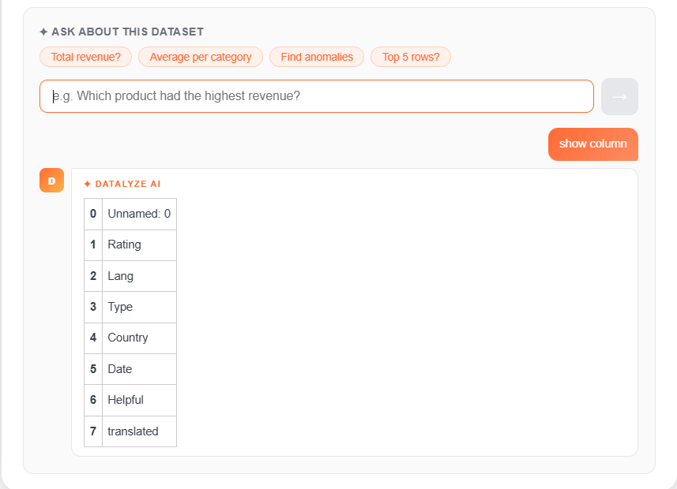
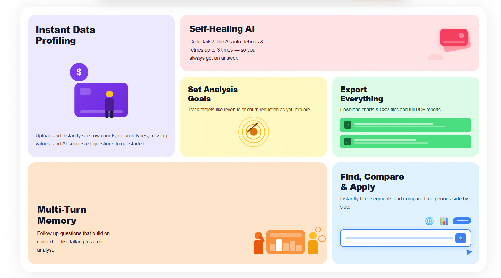

# 🚀 Autonomous Analytics Copilot

> A multi-agent AI system that autonomously analyzes datasets using natural language — with structured planning, safe execution, validation, and intelligent retry logic.

---

## 📌 Overview

Autonomous Analytics Copilot is a full-stack AI analytics engine that allows users to:

* Upload CSV datasets
* Ask natural language questions
* Automatically generate executable analysis code
* Execute code safely in a sandbox
* Detect and recover from failures
* Maintain multi-turn memory
* Generate executive summaries
* Export PDF reports
* Log full audit trails

Unlike simple “Chat with CSV” tools, this system implements a structured **multi-agent orchestration architecture** with validation and retry logic for reliable analytical reasoning.

---

# 🖼 Demo & Screenshots


### 🧠 Website UI


### 📊 Upload Screen


### 📈 Dataset Overview


### 🧠 Query Example



### ⚙️ Features Section




---

# 🧠 Core Features

## 1️⃣ Instant Data Profiling

* Row & column counts
* Data types detection
* Missing value analysis
* Skew & anomaly signals
* AI-suggested starter questions
* Dataset health score

---

## 2️⃣ Multi-Agent Architecture

The system is structured into modular agents:

* **PlanningAgent** – Converts natural language into structured analysis plans
* **ExecutionAgent** – Generates and executes pandas code safely
* **ValidationAgent** – Detects empty or failed outputs
* **ExplanationAgent** – Produces executive summaries and confidence scores
* **Orchestrator** – Coordinates reasoning, retry logic, and response generation

---

## 3️⃣ Self-Healing AI (Autonomous Retry Loop)

If execution fails:

* Validation detects the issue
* Error context is injected into replanning
* System retries intelligently (configurable depth)

This prevents silent failures and improves analytical reliability.

---

## 4️⃣ Safe Code Execution

* Sandboxed `exec()` environment
* Controlled namespace isolation
* Enforced `result` variable extraction
* JSON-safe serialization of pandas / numpy objects

---

## 5️⃣ Multi-Turn Memory

* Context-aware planning
* Memory injection from previous queries
* Enables follow-up reasoning similar to a human analyst

---

## 6️⃣ Executive Summaries

* LLM-generated concise insights
* Token-safe prompt construction
* Dataset-aware summarization

---

## 7️⃣ Export & Logging

* PDF report generation
* Query history logging
* Latency tracking
* Confidence scoring
* Plan traceability

---

# 🏗 System Architecture

```
User Query
    ↓
Orchestrator
    ↓
PlanningAgent
    ↓
ExecutionAgent
    ↓
ValidationAgent
    ↓ (Retry if invalid)
ExplanationAgent
    ↓
Structured Response
(Answer + Summary + Confidence + Latency)
```

---

# ⚙️ Tech Stack

## 🖥 Backend

* **FastAPI**
* **PostgreSQL**
* **SQLAlchemy**
* **Pandas**
* **NumPy**
* **ReportLab** (PDF generation)
* **Groq API (Llama 3.1)**
* Custom LLM orchestration layer

## 🌐 Frontend

* **Next.js**
* **React**
* **TypeScript**

## 🧠 Architecture Patterns

* Multi-agent orchestration
* Structured planning layer
* Validation & retry loop
* Token-aware LLM prompting
* JSON-safe serialization boundary

---

# 🧩 Development Phases

## ✅ Phase 1 — Dataset Upload & Processing

* CSV upload
* File storage
* Initial dataset insights

## ✅ Phase 2 — AI Query Execution

* Natural language planning
* Code generation
* Safe sandbox execution

## ✅ Phase 3 — Dataset Insight Engine

* Missing value detection
* Skew & anomaly signals
* Suggested analytical questions

## ✅ Phase 4 — PDF Reporting

* Structured report generation
* Query history integration

## ✅ Phase 5 — Logging & Audit Layer

* AnalysisLog model
* Stored question, plan, summary
* Confidence & latency tracking

## ✅ Phase 6 — Agent Intelligence Layer

* Tool integration
* Memory injection
* Safe type normalization
* Confidence normalization

## ✅ Phase 7 — Multi-Agent Orchestrator

* Modular agent separation
* ValidationAgent
* Autonomous retry loop
* Error-aware replanning
* Token explosion prevention
* JSON-safe serialization

---

# 🧪 Example Queries

* “What is the average revenue by region?”
* “Compare churn rate between 2022 and 2023.”
* “Show top 5 categories by profit.”
* “Now filter for Q4 only.”

Follow-up questions build on context via memory injection.

---

# 🔐 Engineering Challenges Solved

### 🔹 Token Explosion Control

* Prompt truncation
* Limited result previews
* Avoided full dataset injection

### 🔹 Safe Serialization

* Converted pandas DataFrames/Series
* Handled numpy numeric types
* Ensured FastAPI JSON compatibility

### 🔹 Autonomous Error Recovery

* Failure detection
* Structured feedback injection
* Intelligent replanning

### 🔹 Modular Refactor

* Migrated from monolithic agent to structured multi-agent system
* Explicit dependency management
* Clear separation of concerns

---

# 🔮 Future Improvements

* Embedding-based memory retrieval
* State-machine execution logging
* Goal tracking engine
* Advanced time-series comparison module
* Tool routing intelligence
* LLM caching layer

---

# 📌 Project Status

**Phase 7 Complete**

* Multi-agent orchestration stabilized
* Self-healing retry loop implemented
* Token-safe summarization enforced
* JSON-safe result boundary established

Ready for portfolio showcase and further evolution.

---

# Made with love by Raunak

---